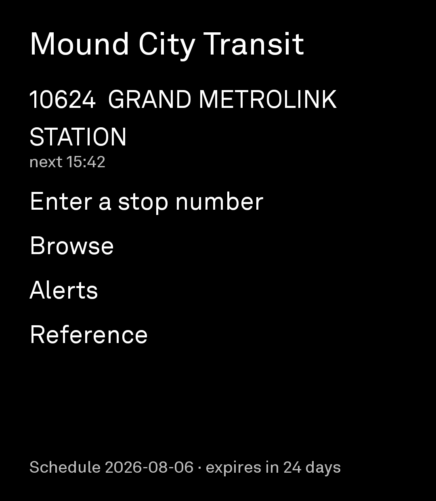
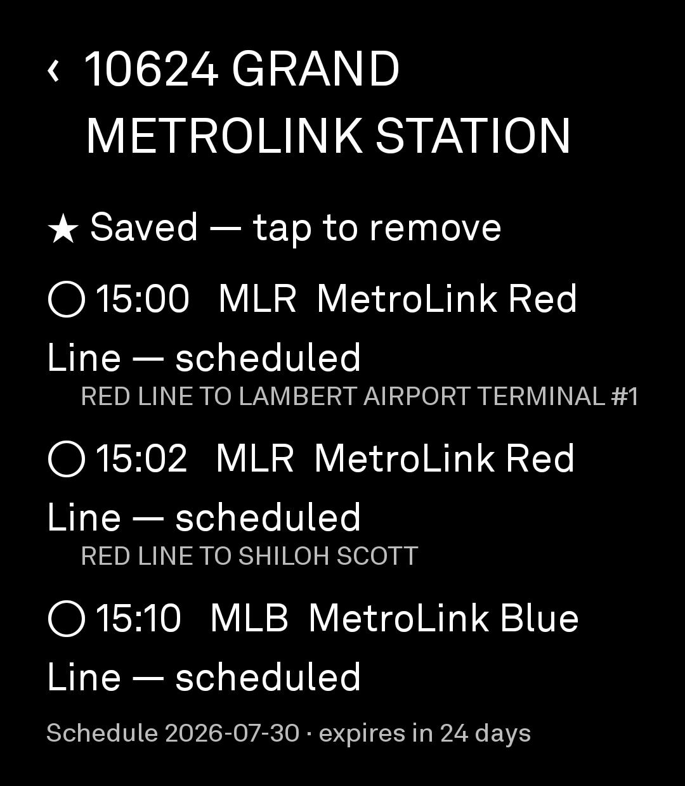
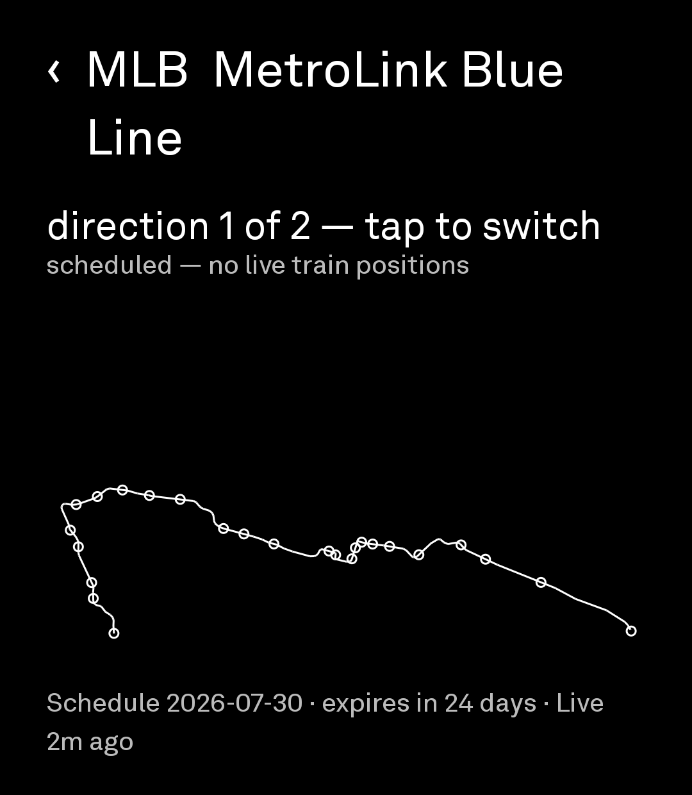
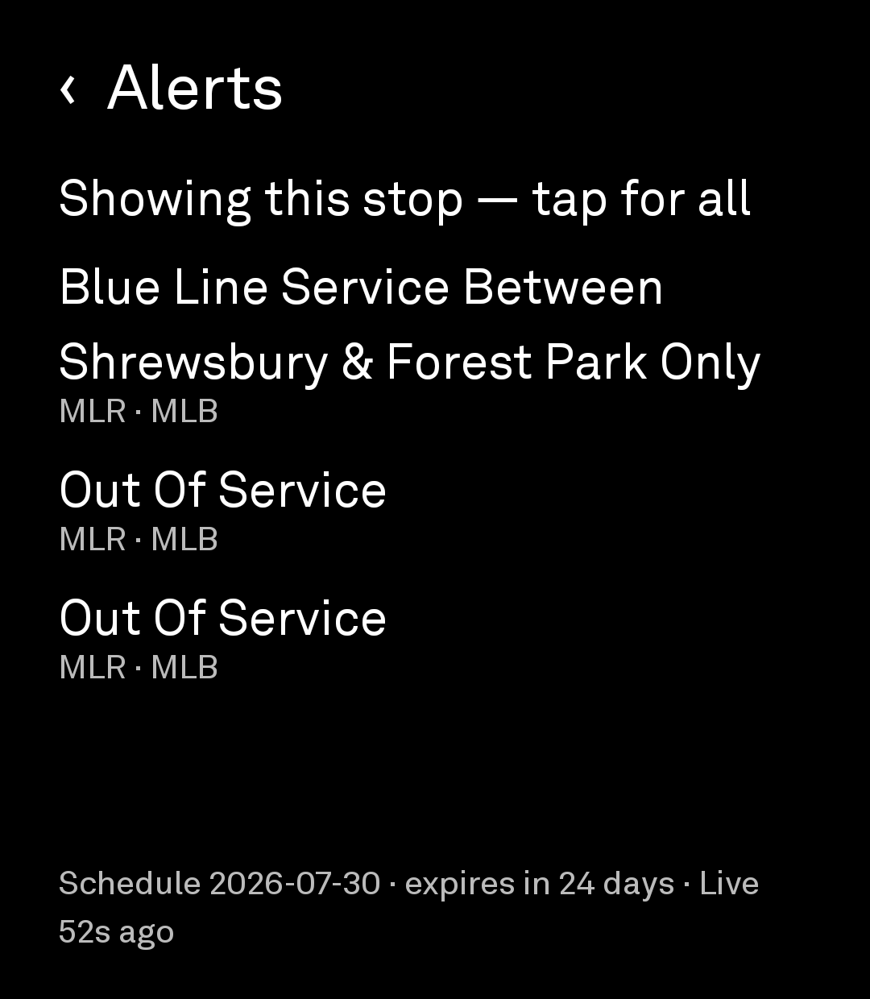

# Mound City Transit

A departure board for St. Louis regional transit, for the Light Phone 3.
(`id = moundcity.transit` — locked at Phase 0.9; permanent once published.)

You type the number printed on the stop sign. It tells you what is coming and when.
It works with the radios off, using a schedule bundled in the app. With a connection
it adds live delays for buses and current service alerts.

It does not plan trips, draw maps, know where you are, or scroll forever.

| Home | Departures | Route viewer | Alerts |
|---|---|---|---|
|  |  |  |  |

*Screenshots from a physical Light Phone 3, 2026-08-06. Every screen carries its
schedule-age footer: the Home capture postdates the phone's own daily refresh
(footer 2026-08-06), the others show the as-shipped bundle (footer 2026-07-30) —
the footer dating the difference is the feature.*

---

## What it does

- **Departures at a stop.** Type the 3–5 digit number on the sign. The next eight
  departures, with route, destination, time, and — for buses with live data — whether
  they are running early or late.
- **Saved stops**, up to twelve, each showing its next departure.
- **Trip detail.** How many stops back the bus is ("about 1 stop away · 0.7 mi
  (straight line)" — the distance shows only when it is one stop or closer) and
  every remaining stop to the end of the line.
- **Browse** by rail station (38), transit center (30 named, 45 platform stops),
  or route (60 entries: 44 Missouri, 14 Illinois, 2 rail lines — the feed's 62
  `route_id`s include two per rail line across the service-change transition).
- **A schematic route viewer.** One route at a time: the route's own shape from the
  feed, its stops as hollow circles, and — for buses — the agency's published
  vehicle positions as filled dots. No basemap, no tiles, never your location.
- **Service alerts** from the agency's live feed, filtered to the routes that serve
  your saved stops.
- **Reference:** fares and passes, how to pay, accessibility and bike racks, and the
  phone numbers worth having — including the 24/7 transit public safety line.
- **The age of everything, on screen, always.** When the schedule expires, the
  departure list is replaced by a message rather than quietly showing stale times.

## What it does not do

No trip planning, no address or destination search, no maps, no "stops near me", no
notifications, no accounts, no history, no infinite anything. Trains are shown from
the timetable and always labelled **scheduled** — the agency publishes no real-time
data for rail, and a timetable should not be dressed up as a prediction.

---

## Data

Four public files from Metro Transit St. Louis (Bi-State Development Agency):

```
https://www.metrostlouis.org/Transit/google_transit.zip          GTFS schedule
https://www.metrostlouis.org/RealTimeData/StlRealTimeTrips.pb    GTFS-RT trip updates
https://www.metrostlouis.org/RealTimeData/StlRealTimeVehicles.pb GTFS-RT vehicle positions
https://www.metrostlouis.org/RealTimeData/StlRealTimeAlerts.pb   GTFS-RT service alerts
```

The schedule is bundled in the app so the tool works offline from first launch, and a
once-daily background job fetches a newer one. Real-time data is fetched only in the
foreground — on the departures and viewer screens when you tap refresh, and once
when the alerts screen opens with nothing cached — never on a timer, 30 seconds
minimum apart. The schedule request uses a conditional GET (`If-Modified-Since`),
so an unchanged schedule costs a `304` and no body. The server does not honour gzip
(measured), so revalidation — not compression — is the data budget, and the tool is
built accordingly.

### Not affiliated with the agency

**This tool is not affiliated with, endorsed by, or sponsored by Metro Transit St.
Louis, Bi-State Development Agency, or the St. Clair County Transit District.** It
uses their published open data under the terms below. No agency trademark, logo, line
mark, or brand colour is used anywhere in the tool.

Route and destination names such as "MetroLink Blue Line" or "RED LINE TO SHILOH
SCOTT" appear on screen because they are the `route_long_name` and `trip_headsign`
values in the agency's own feed, rendered verbatim. The same applies to contact and
fare labels on the Reference screen ("Metro Public Safety", "Metro Call-A-Ride"):
they are captured from the agency's public website and rendered as data, with their
capture date shown. Renaming an agency's own route names or phone-line names would
make the tool wrong, not safer. The tool's own chrome — its name, labels, headings,
and messages — uses no agency mark.

### Terms of Use

Reproduced verbatim from <https://www.metrostlouis.org/developer-resources/>:

> **Terms of Use:**
>
> Bi-State Development Agency dba Metro hereby grants you (Licensee) non-exclusive,
> limited and revocable rights to use, reproduce, and redistribute Transit District
> Data (Data) subject to the following Terms:
>
> • Agency trademarks and copyrighted materials, including any confusingly similar
> variants, may not be used in association with Data unless approved by the Agency.
>
> • Data is provided on an "as is" and "as available" basis. Agency makes no
> representations or warranties of any kind, express or implied. Agency disclaims all
> warranties, express or implied, including but not limited to implied warranties of
> merchantability and fitness for a particular purpose. Agency and its employees,
> officers, directors and agents will not be liable for damages of any kind arising
> from the use of Data including but not limited to direct, indirect, incidental,
> punitive and consequential damages.
>
> • Agency reserves the right to alter and/or no longer provide Data at any time
> without prior notice.
>
> • Agency maintains title, ownership, rights and interest in and to Data.
>
> By using Agency Data, you agree to be bound by all of the Terms and Conditions set
> forth in this agreement.
>
> **Applicable Law**
>
> The laws of the State of Missouri shall govern all rights and obligations under
> this Agreement, without giving effect to any principles of conflicts of laws.
>
> **Entire Agreement**
>
> This Agreement constitutes the complete and exclusive agreement between Agency and
> Licensee with respect to the subject matter hereof and supersedes all prior oral or
> written understandings, communications, or agreements not specifically incorporated
> herein. Agency reserves the right to modify or revoke this agreement at any time.

**"Revocable" is designed for.** If the feeds stop being served, the tool falls back
to its bundled schedule and says the source is unavailable. It does not break.

**"As is" is passed through honestly.** Every screen shows how old its data is.
Schedule times are the agency's; delay figures are the agency's; the tool adds
arithmetic and nothing else.

---

## Accuracy notes

Worth knowing, because they are properties of the data rather than of the tool:

- **There is no real-time data for MetroLink.** Trains are timetable only.
- **Delay is reported per trip, not per stop**, in whole minutes, and typically ranges
  from 5 minutes early to 20 minutes late.
- **About 9% of in-service buses have no live data** at any given moment.
- **Distance to a vehicle is straight-line**, not along the road. It is labelled as
  such and is never converted into a time estimate.
- **Wheelchair accessibility is shown per stop from the agency's own data.** The feed
  marks a majority of stops as not accessible; that is the agency's classification,
  not the tool's.
- **Fares are bundled and dated.** The agency is mid-way through a fare-system
  migration, so the fares screen shows the date its figures were captured and says to
  verify before relying on them.

---

## Why this is a clean tool to vet

A departure board for one public transit agency's open data. You type the number
printed on the stop sign and it tells you what is coming and when. It works with the
radios off using a bundled schedule; with a connection it adds live delays and
current service alerts.

- **Not a feed / not infinite.** Every list has a bound written into the code: **8**
  departures per stop, **12** saved stops, **38** rail stations, **30** transit
  centers, **60** route entries, one route at a time in the viewer, and the
  remaining-stops list ends at the end of the line. Real-time never refreshes on a
  timer — it is fetched only in the foreground: on the departures and viewer
  screens when the user taps refresh, and once when the alerts screen opens with
  nothing cached, 30 s minimum apart. The single piece of background work is a
  **once-daily** schedule refresh that downloads the same timetable already in the
  APK, just newer. No realtime polling, no notifications, no badges, no history,
  no "since you last checked".
- **Not browser-adjacent.** Native Compose and the `sdk:ui` primitives throughout. No
  WebView, no remote HTML, no map tiles, no PDF. The agency's per-alert `url` field is
  present in the feed and is deliberately dropped.
- **Not messaging or social.** Nothing is sent anywhere. No accounts, no presence, no
  sharing, no user content. The only text input is a stop number, entered locally.
- **Not commercial.** Open source, MIT, no accounts, no ads, no upsell, no analytics,
  no telemetry, no third-party SDK. Fares are shown as public reference information;
  nothing can be bought.
- **Permissions:** `android.permission.INTERNET` — to fetch four public files from one
  host; `android.permission.ACCESS_NETWORK_STATE` — so the tool can say "you're
  offline, showing the bundled schedule" instead of spinning. **No location permission
  is requested**, although two are allow-listed and the phone has GPS: the input
  design is built on the fact that every stop already has a unique number on its sign.
- **Dependencies:** allow-listed only. Declared by the tool:
  `androidx.datastore:datastore-preferences-core`, `com.squareup.okhttp3:okhttp`,
  `org.jetbrains.kotlinx:kotlinx-serialization-json` (parses only bundled reference
  JSONs — fares and contacts today; holidays ships bundled for the post-pick
  holiday card), and the SDK — Compose, lifecycle, and coroutines arrive through
  the SDK itself. No KSP processor beyond the SDK plugin's own. **No protobuf
  runtime:** the GTFS-Realtime decoder is ~350 lines of plain Kotlin in an
  Android-free package, unit-tested against captured feed bytes.
- **Data:** outbound is HTTP GETs to one host, `metrostlouis.org`, for four public
  files — no identifiers, no query parameters, no user data, no request body. The
  User-Agent names the tool and a contact address. Saved stop numbers live in
  DataStore and are never transmitted. Nothing about the user leaves the device.

### On overlap with the built-in Directions tool

Directions answers *"how do I get from A to B"* via HERE, including a transit mode.
This answers *"I'm standing at this stop — what's coming?"*, and answers it offline
and with real-time data, which Directions does not do. **This tool never routes:** no
origin/destination pair, no address entry, no geocoder, no turn-by-turn. The boundary
is deliberate.

---

## Building

```sh
export JAVA_HOME=$(/usr/libexec/java_home -v 17)
./gradlew :tool:testDebugUnitTest     # the pure-JVM gate
./gradlew :tool:assembleDebug         # build + plugin scan
./gradlew check                       # CI gate
```

`:tool:clean` must be run as a separate invocation.

## Licence

MIT, inherited from the repository root `LICENSE`. Transit data remains the property
of Bi-State Development Agency dba Metro under the Terms of Use above.
